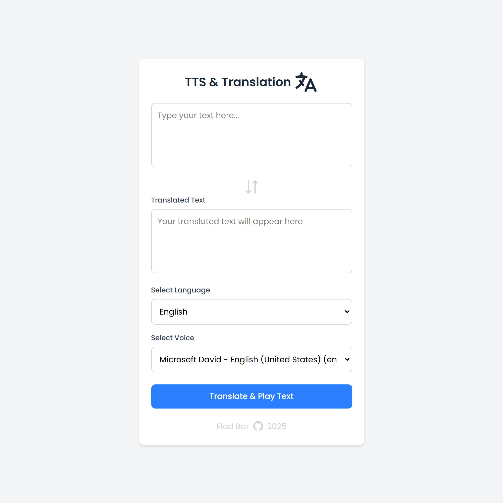

# TTS & Translation

Text-to-Speech app translate a given text and converts text into natural-sounding audio, offering customizable voices, and multilingual support.

## install vercel package globally:

`npm i -g vercel`

## login to vercel command:

`vercel login`

## create a new vercel project:

`vercel dev`

## deploy project to vercel:

`vercel`

## Create an API key in Google cloud console

- [Translate docs, audio, and videos in real time with Google AI](https://cloud.google.com/translate?hl=he)
- [API and references](https://cloud.google.com/translate/docs/reference/rest/v2/translate)
